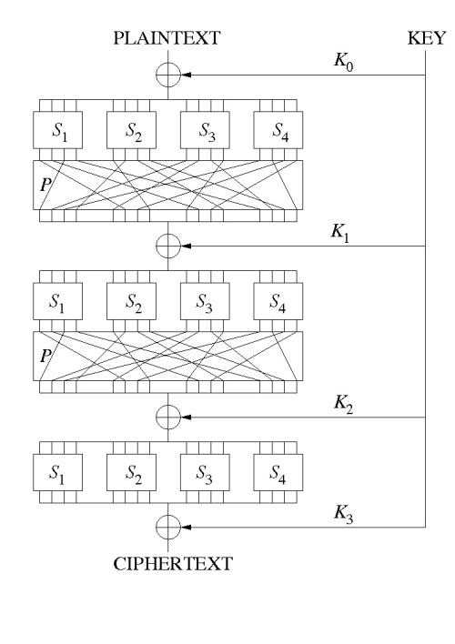

# Substitution-Permutation Network (SPN) cipher & Linear Cryptanalysis

## Motivation
Block ciphers are symmetric algorithms and utilise a key for encryption and decryption of data. SPNs which use one of the architectures are used for designing block ciphers. In Internet of Things (IoT) paradigm, many of the physical world objects will be on the network in any form creating a heterogeneous environment for IoT. In such environment, it is a basic requirement to encrypt information so that chip identification can be prevented from an intruder. The communication must be secured in IoT with confidentiality, integrity and authentication services. The data inside sensor nodes must be stored in an encrypted form. A
number of new factors like limited computational power, RAM size, ROM size, register width, different operating
environment and etc. constrained IoT to use traditional security measures. These constraints on IOT enabled devices spearheads the inception of a new field, Lightweight Cryptography. These are broadly categorised as hash functions, stream ciphers, and block ciphers. Block ciphers are known to be workhorses in the cryptographic environment as they are practically easier to implement, more efficient and can acquire higher diffusion and error propagation. SPN cipher comprises many P-boxes and S-boxes. Issues such as high energy consumption and low efficiency resulted from myriads of rounds of AES algorithm do not affect the performance of the algorithm much. Crptanalysis is the study of gaining access to the contents of enrypted messages without being given the cryptographic key. From the hacker's perspective, he needs to have the information available to stage his attack. 

## Research
A basic Substitution-Permutation Network cipher, implemented by following 'A Tutorial on Linear and Differential Cryptanalysis' by Howard M. Heys
- Basic SPN cipher which takes as input a 16-bit input block and has 4 rounds.
- Each round consists of (1) substitution (2) transposition (3) key mixing

### Substitution
Firstly, the 16-bit data block is split into four 4-bit sub-blocks. Each sub-block develops an input to a 4×4 S-box (substitution with 4 input and 4 output bits), which can be executed with a table lookup of sixteen 4-bit values, indexed by the integer indicated by the 4 input bits. The most basic characteristic of an S-box is that it is a nonlinear mapping. Hence, same non-linear mapping is used for all S-boxes. The mapping in this cipher is selected from the S-boxes of DES. (It is the first row of the first S-box.) In the table, the most significant bit of the hexadecimal notation symbolises the leftmost bit of the S-box.

| **input**  | 0 | 1 | 2 | 3 | 4 | 5 | 6 | 7 | 8 | 9 | A | B | C | D | E | F |
|:-----------|:-:|:-:|:-:|:-:|:-:|:-:|:-:|:-:|:-:|:-:|:-:|:-:|:-:|:-:|:-:|:-:|
| **output** | E | 4 | D | 1 | 2 | F | B | 8 | 3 | A | 6 | C | F | 9 | 0 | 7 | 

### Permutation
The permutation part of a round is simply the tranposition of the bits or the permutation of the bit positions. The permutation of Figure 1 is given in Table 2 (where the numbers represent bit positions in the block, with 1 being the leftmost bit and 16 being the rightmost bit) and can be simply described as: the output i of S-box j is connected to input j of S-box i. Note that there would be no purpose for a permutation in the last round and, hence, our cipher does not have one.

| **input**  | 1 | 2 | 3 | 4 | 5 | 6 | 7 | 8 | 9 | 10 | 11 | 12 | 13 | 14 | 15 | 16 |
|:-----------|:-:|:-:|:-:|:--:|:-:|:-:|:--:|:--:|:--:|:--:|:--:|:-:|:-:|:--:|:-:|:-:|
| **output** | 1 | 5 | 9 | 13 | 2 | 6 | 10 | 14 | 3 | 7 | 11 | 15 | 4 | 8 | 12 | 16 | 

### Key Mixing
A simple bit-wise exclusive-OR (XOR) between the key bits associated with a round is used to perform key mixing and the data block input to a round. Moreover, a subkey is applied after the last round to ensure that the last layer of substitution cannot be easily avoided by a cryptanalyst that easily works backward through the substitution in the last round. In this cipher, it is assumed that all bits of the subkeys are generated independently and unrelated.

### Decryption
Data is essentially passed backwards through the network for decryption. Hence, decryption is also of the form of an SPN as illustrated in the first figure. However, the mappings used in the S-boxes of the decryption network are the inverse of the mappings in the encryption network. This implies that in order for an SPN to allow for decryption, that is, a one-to-one mapping with the same number input and output bits. As well, in order for the network to properly decrypt, the subkeys are applied in reverse order and the bits of the subkeys must be moved around according to the permutation, if the SPN is to look similar to the first figure. It is also important to note that the lack of the permutation after the last round ensures that the decryption network can be the same structure as the encryption network. (If there was a permutation after the last substitution layer in the encryption, the decryption would require a permutation before the first layer of substitution.)

### Linear Cryptanalysis
Linear cryptanalysis is a technique for attacking an SPN. It uses linear approximation to an S-box to form a probabilistic assessment of the plaintext corresponding to an encoded message. It does not guarantee a precise break for the code but it is possible to come up with sufficient probabilistic assessment making inroads into educated guesses as to what the plaintexts would be by narrowing down the number of cases via brute force. 

## Design & Development

### SPN Cipher
- Takes a 16-bit block as input and consists of 4 rounds.
- Each round consists of (1) substitution (2) transposition (3) key mixing

#### (1) Substitution
- 4x4 bijective, one sBox used for all 4 sub-blocks of size 4. Nibble wise
- Apply sBox (1) to a 16 bit state to perform non-linear mapping 
- Return the result which are known as subStates

#### (2) Permutation
-  Output i of S-box j is connected to input j of S-box i in bitwise manner

#### (3) Key mixing
- Bitwise XOR between round subkey and data block input to round
- Key schedule: independent random round keys.
- Take the sha-hash of a 128-bit 'random' seed and then take the first 80-bits of the output as out round keys K1-K5 (Each 16 bits long).

#### (4) Simple SPN Encryption Function
- First three rounds of simple SPN cipher
- XOR state with round key (3, subkeys 1,..,4)
- Break state into nibbles, perform sBox on each nibble, write to state (1)
- Permute the state bitwise (2)
- Final round of SPN cipher (k4, sBox, s5)
- penultimate subkey (key 4) mixing
- Final subkey (key 5) mixing

#### (5) Simple SPN Decryption Function
- Derive round keys
- Undo final round key
- Apply inverse s-box
- Undo first 3 rounds of simple SPN cipher
- XOR state with round key (3, subkeys 4,..,0)
- Un-permute the state bitwise (2)
- Apply inverse s-box
- XOR state with round key 0
- The ciphertexts are written to file in the 'testData' directory in CSV format

### Linear Cryptanalysis

#### (1) Linear Approximation Table
- Build table of input and output values
- Build an ordered dictionary between input and output values
- Form a Linear Approximation Table (LAT) by initialising all the probability bias with zeros
- A complete enumeration of all the linear approximations of the simple SPN cipher S-Box is performed
    - Dividing an element value by 16 gives the probability bias for the particular linear combination of input and output bits
- Print the Linear Approximation Table

#### (2) Attacking SPN
- By recovering a subset of the subkey bits that follow the last round
- Construct the following equation that holds with probability 0.75 by using LAT 
- Let U_{i} and V_{i} denote the 16-bit block of bits at the input and output of the round i S-Boxes, respectively
- Let K_{i,j} represent the j\'th bit of the subkey block of bits exclusive-ORed at the input to round i
- Let P_{i} represent the i\'th input bit
- U_{4,6} ⊕ U_{4,8} ⊕ U_{4,14} ⊕ U_{4,16} ⊕ P_{5} ⊕ P_{7} ⊕ P_{8} ⊕ SUM(K) = 0 where
    - SUM(K) = K_{1,5} ⊕ K_{1,7} ⊕ K_{1,8} ⊕ K_{2,6} ⊕ K_{3,6} ⊕ K_{3,14} ⊕ K_{4,6} ⊕ K_{4,8} ⊕ K_{4,14} 
    ⊕ K_{4,16}
    - Holds with a probability of 15/32 (with a bias of 1/32)
- sum(K) is fixed (by the key, k), U_{4,6} ⊕ U_{4,8} ⊕ U_{4,14} ⊕ U_{4,16} ⊕ P_{5} ⊕ P_{7} ⊕ P_{8} = 0
    - hold with a probability of either 15/32 or 1 - (15/32)
    - linear approximation of the first three rounds of the cipher with a bias of magnitude 1/32
- k_5 denotes last 16 bits of k
- k_5|k_8|k_13|k_16 are partial subkey values
- countTargetBias is initialised as an empty array which contains 256 data entries, tried for each target partial subkey value
- num_Attacks is initialised to 10,000 which indicates the simulation of attack on SPN cipher by generating 10000 known plaintext/ciphertext values
- For each target partial subkey value k_5|k_8|k_13|k_16 in [0,255], increment the count whenever 
U_{4,6} ⊕ U_{4,8} ⊕ U_{4,14} ⊕ U_{4,16} ⊕ P_{5} ⊕ P_{7} ⊕ P_{8} ⊕ SUM(K) holds true
    - Compute U_{4,6} ⊕ U_{4,8} ⊕ U_{4,14} ⊕ U_{4,16} by running the ciphertext backwards through the target 
    partial subkey and S-Boxes
    - XOR ciphertext with subKey bits
    - Run backwards through s-boxes
    - Compute linear approximation U_{4,6} ⊕ U_{4,8} ⊕ U_{4,14} ⊕ U_{4,16} ⊕ P_{5} ⊕ P_{7} ⊕ P_{8}
    - If linear approximation = 0, countTargetBias[target] increases count by 1
- The count which deviates the largest from half of the number of plaintext/ciphertext samples is assumed to be the correct value
- maxResult and maxIndex are initialised to zero
- For every rIndex and result for every bias, if result is equivalent to maxResult derived so far from previous iterations, maxResult is updated with the new result and maxIndex is also updated by new rIndex
    -  correct target partial subkey has clearly the highest bias
- if the maxIndex which is the subkey value is equivalent to k_5_5_8 and k_5_13_16, Success! else Failure 

## Use of code
### basic_SPN.py
 - Performs the fundamental SPN cipher which comprises key generation, encryption and decryption methodologies
 - The cipher takes 16-bit block as input and has 4 rounds, each consisting of substitution, transposition and key mixing
 - Running this file will encrypt 10,000 incremental values using a random key 
 - The ciphertexts are written to file in the 'testData' directory in CSV format
- `$ python .\basic_SPN.py`

### linear_crptanalysis.py
- Attacks the SPN cipher in _basic_SPN.py_ using linear cryptanalysis 
- Obtain a linear approximation for the first 3 rounds which we then utilise to yield some of the key bits 
- Running this file will print the Linear Approximation Table (LAT) for the SPN S-box, generate a random key and then will recover 8~bits of the key using linear cryptanalytic techniques
- `$ python .\linear_cryptanalysis.py`

## References
- test

